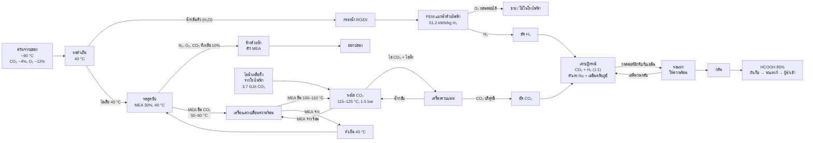

# แผนภาพกระบวนการผลิตกรดฟอร์มิก (ดักจับ CO₂ ด้วย MEA 30%)

ทำทุกขั้นตอนที่โรงไฟฟ้าบางปะกง ขนาดกรด 85% ปีละ 10,000 ตัน (S18)
รหัส S.. คือแหล่งที่มาใน `SOURCES.md`

## อุณหภูมิและความดันแต่ละจุด

| จุด | ค่า | แหล่งที่มา |
|---|---|---|
| ควันจากปล่อง | ~90 °C | ❌ ยังไม่มีแหล่ง ต้องขอค่าจริงจาก กฟผ. |
| องค์ประกอบไอเสีย | CO₂ ~4%, O₂ ~12% | S05 🔎 |
| MEA ที่เข้าหอดูดซับ | 40 °C | S19 🔎 |
| MEA อิ่มที่ออกจากหอดูดซับ | 50–60 °C | S19 🔎 |
| MEA อิ่มหลังเครื่องแลกเปลี่ยนความร้อน | 100–110 °C | S19 🔎 |
| หอไล่ / หม้อต้ม | 115–125 °C, ~1.5 bar | S19 🔎 |
| CO₂ ที่ MEA อุ้ม (อิ่ม / จาง) | 0.5 / 0.2 mol CO₂ ต่อ mol MEA | S19 🔎 |
| ความร้อนไล่ CO₂ | 3.7 GJ/t CO₂ | S06 🔎 |
| MEA เติมชดเชย | 2.2 kg/t CO₂ | S07 🔎 |
| ดักจับ CO₂ ได้ | 90% | S08 🔎 |
| ไฟฟ้า PEM | 51.2 kWh/kg H₂ | S09 🔎 |
| เตาปฏิกรณ์: ตัวเร่งและเอมีน | Ru 250 ppm + trihexylamine | S11 ✅ |
| เตาปฏิกรณ์: อุณหภูมิ / ความดัน | ยังไม่ได้ใส่ | ต้องดึงจากงานวิจัย S11 |

## สิ่งที่แก้จากแผนภาพที่ทีมวาดมือ

| ของเดิม | แก้เป็น | เหตุผล |
|---|---|---|
| "น้ำกลั่นตัว H₂" | น้ำกลั่นตัว (H₂O) → กรองน้ำ RO/DI → PEM | ยังเป็นน้ำ จะกลายเป็น H₂ หลังผ่าน PEM และน้ำกลั่นตัวมี CO₂ ละลายอยู่ ต้องกรองก่อน |
| "Au + Amine" | Ru + เอมีนตติยภูมิ | ตัวเร่งคือรูทีเนียม ส่วนเอมีนในเตาไม่ใช่ MEA (MEA ต้มกับกรดฟอร์มิกจะกลายเป็นฟอร์มาไมด์) |
| MEA เป็นเส้นตรง | MEA วนกลับ: หอไล่ → เครื่องแลกเปลี่ยนความร้อน → ทำเย็น 40 °C → หอดูดซับ | MEA ใช้ซ้ำเป็นวงจร |
| ไม่มีแหล่งความร้อนของหอไล่ | ไอน้ำเหลือทิ้งจากโรงไฟฟ้า → หอไล่ | จุดเด่นของการติดตั้งที่บางปะกง |
| ไม่มีก๊าซขาออกหอดูดซับ | N₂, O₂, CO₂ ที่เหลือ → ล้างน้ำ → ปล่อง | ก๊าซที่ไม่ถูกดูดต้องมีทางออก และต้องดัก MEA ไม่ให้หลุด |
| "ปล่อยความร้อน CO₂" | เครื่องควบแน่น: น้ำกลับหอไล่, ได้ CO₂ บริสุทธิ์ | แยกไอน้ำออกจาก CO₂ |
| CO₂ และ H₂ เข้าเตาตรง ๆ | อัด CO₂ และอัด H₂ ก่อนเข้าเตา | เตาปฏิกรณ์ทำงานที่ความดันสูง |
| เตาปฏิกรณ์ → HCOOH 85% ทันที | เตา → หอแยก (เอมีนวนกลับ) → กลั่น → HCOOH 85% | เตาได้กรดที่จับกับเอมีน ต้องแยกและกลั่นก่อน |
| ไม่มี O₂ จาก PEM | เพิ่ม O₂ ผลพลอยได้ | PEM ได้ O₂ ~8 kg ต่อ H₂ 1 kg |
